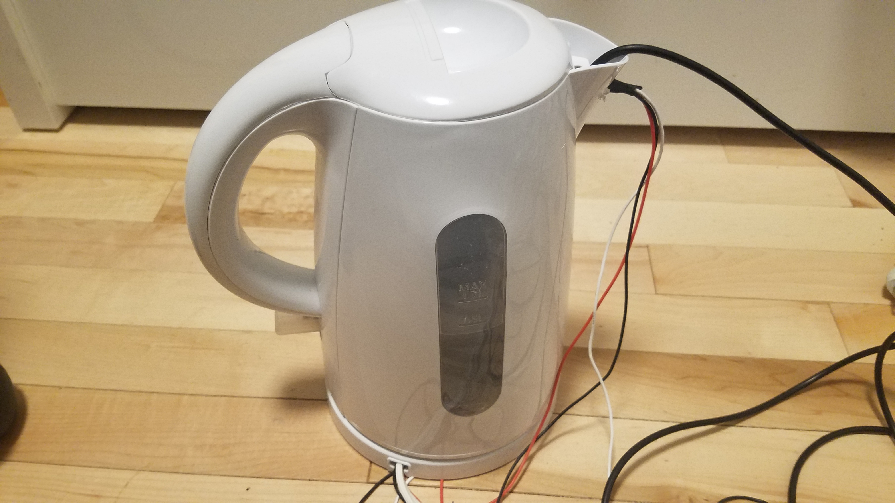

<!---layout: page
title: "About"
permalink: /about/--->

<h1> MagicMappedKettle </h1>
Mappings for DHT11 & DHT22 sensors to control digital processing of boiling water. Completed in part as a final project for MUMT306 at McGill. Makes use of an Arduino for transfer of sensor data into MaxMSP, for further routing and use in audio synthesis. This github also includes some basic patches to get you started on mapping DHT sensor data to OSC messages.

<h2> Read More About </h2>
<a href="https://kaseypocius.github.io/MUMT306-MagicMappedKettle/why"> Why?</a> 
<a href="https://kaseypocius.github.io/MUMT306-MagicMappedKettle/how"> How?</a> 
<a href="https://kaseypocius.github.io/MUMT306-MagicMappedKettle/demos"> Demos</a> 
<a href="https://kaseypocius.github.io/MUMT306-MagicMappedKettle/thanks"> Thanks</a> 
<a href="https://kaseypocius.github.io/MUMT306-MagicMappedKettle/tutorial"> Tutorial on Setting up the Example Patches</a>
