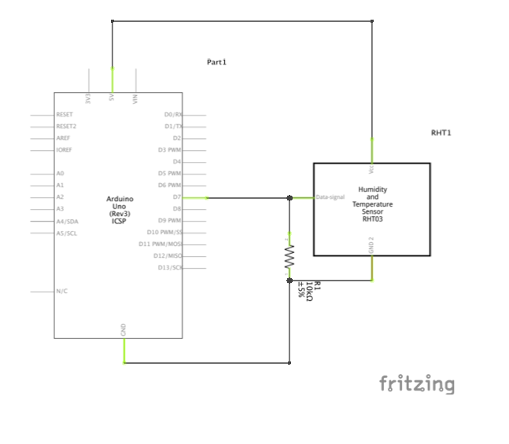

<!---layout: page
title: "How?"
permalink: /how/--->

<h2> How? </h2>
My Example project uses two sets of sensors, <a href="https://jezrileyfrench.co.uk/hydrophones.php"> a Jez Riley french D-Series Hydrophone </a> and a <a href="https://abra-electronics.com/sensors/sensors-temperature-en/dht22-temperature-humidity-sensor.html"> DHT22 Humidity & Temperature Sensor </a> connected to Max via an Arduino Uno. In Max the data is converted to OSC, which I use to send to data to Reaper.

In the github, I have included a basic patch to get the sensor data into Max, and then converted to more general OSC data, to serve as a jumping off point for building your own mappings with just the sensor.

<a href="https://github.com/adafruit/DHT-sensor-library"> As I use the DHT family of sensors, my arduino code makes use of the Arduino DHT library from Adafruit, which you can download here. </a>

<h2> Why Use My Patches?</h2>
I've created some utility functions to help get more "expressive" data in regards to boiling water, which can be easily adapted to any situation where positives trends in humidity & temperature over time are needed to be mapped to A/V applications. These require positive trends as I have provided a "self calibration" utility in the Max patches, where it will recalibrate if a temperature lower than it's calibration value is detected, providing the max patches with the largest data range to calculate relative sensor saturation for it's ambient environment. While I use the DHT22 as it can safely reach & sustain much higher temperature values, I've included code for the DHT11 as well.

The OSC mapping used in the Max patch system is also general enough that a sensor change should only need you to change the arduino code.

<h2>Why did you decide on these sensors?</h2>
I wanted to have sensors that would be easily mountable inside of the kettle, could be exposed to high temperature & humidity values, had as little exposed electronics as possible, and were relatively cheap & easy to find. I settled on the DHT22 <a href="https://forum.arduino.cc/index.php?topic=432544.0"> though I did</a> <a href="https://www.letscontrolit.com/forum/viewtopic.php?t=1582"> find ample </a> <a href="https://www.reddit.com/r/arduino/comments/9ftsg7/dht22_strange_humidity_numbers/"> evidence online </a> that these DHT sensors are generally unreliable and in accurate, I seem to have lucked out here. Your mileage may vary.

The Hydrophone acts as my way to capture audio from the Kettle, and allows the kettle to act as a amplified percussive instrument of sorts. I've personally used the amplitude envelope of the hydrophone to control the partial gate of a FFT vocoder, which allows me to play with the partial content of my synthesized signal through percussive strikes as well as boiling the kettle, independent of the DHT sensor readings.

<h2>Mount Job & Circuit Buil </h2>
I heat shrunk some temperature resistant wiring to the data, power & ground pins of the DHT22, and then covered those with another layer of shrink wrap to help water seal the cable connections. It's not the cleanest job, but it seems to work more than well enough.  

 

I then mounted the DHT22 in the beak of the kettle, and soldered a 10k resistor between the data pin and ground pin on to a protoboard small enough to fit under the kettle comfortably, with my output wires running out to the Arduino. I was lucky enough that I could fit these extra sensor cables in the cable management slot in the kettle already, so this is relatively clean, all things considered.
 

  

 
A better way to hide all the cabling would be ideal,  but I couldn't find a good way to mount sensors in the base and still measure humidity.

 <a href="https://kaseypocius.github.io/MUMT306-MagicMappedKettle/about"> Back to the About</a>
