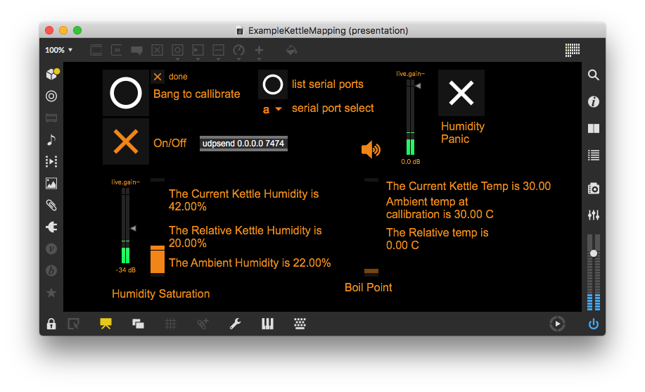

<!---layout: page
title: "How?"
permalink: /how/--->

<h2> How? </h2>
My Example project uses two sets of sensors, <a href="https://jezrileyfrench.co.uk/hydrophones.php"> a Jez Riley french D-Series Hydrophone </a> and a <a href="https://abra-electronics.com/sensors/sensors-temperature-en/dht22-temperature-humidity-sensor.html"> DHT22 Humidity & Temperature Sensor </a> connected to Max via an Arduino Uno. In Max the data is converted to OSC, which I use to send to data to Reaper.

In the github, I have included a basic patch to get the sensor data into Max, and then converted to more general OSC data, to serve as a jumping off point for building your own mappings with just the sensor.

<a href="https://github.com/adafruit/DHT-sensor-library"> As I use the DHT family of sensors, my arduino code makes use of the Arduino DHT library from Adafruit, which you can download here. </a>

<h2> Why Use My Patches?</h2>
I've created some utility functions to help get more "expressive" data in regards to boiling water, which can be easily adapted to any situation where positives trends in humidity & temperature over time are needed to be mapped to A/V applications. These require positive trends as I have provided a "self calibration" utility in the Max patches, where it will recalibrate if a temperature lower than it's calibration value is detected, providing the max patches with the largest data range to calculate relative sensor saturation for it's ambient environment. While I use the DHT22 as it can safely reach & sustain much higher temperature values, I've included code for the DHT11 as well.

The OSC mapping used in the Max patch system is also general enough that a sensor change should only need you to change the arduino code.

<h2>Why did you decide on these sensors?</h2>
I wanted to have sensors that would be easily mountable inside of the kettle, could be exposed to high temperature & humidity values, had as little exposed electronics as possible, and were relatively cheap & easy to find. I settled on the DHT22 <a href="https://forum.arduino.cc/index.php?topic=432544.0"> though I did find </a> <a href="https://www.reddit.com/r/arduino/comments/9ftsg7/dht22_strange_humidity_numbers/"> evidence online </a> that these DHT sensors are generally unreliable and in accurate, I seem to have lucked out here. Your mileage may vary.

The Hydrophone acts as my way to capture audio from the Kettle, and allows the kettle to act as a amplified percussive instrument of sorts. I've personally used the amplitude envelope of the hydrophone to control the partial gate of a FFT vocoder, which allows me to play with the partial content of my synthesized signal through percussive strikes as well as boiling the kettle, independent of the DHT sensor readings.

Originally, I had conceived of this project using many more sensors than the final version ended up with. Aside from previously mentioned sensor incompatibilities with the task at hand, I found adding more Thermistors didn't give me any new variances in data, and to an audience member unaware of the inner workings of the sensors, I felt I had enough data already with the DHT & Hydrophone combo, as many of the perceived phenomenon of boiling water (ie increase in water turbulence, presence of steam) could be determined simply by temperature & humidity data regardless, or at least estimated from the data.

<h2>Mount Job & Circuit Build </h2>
 

 
 
I heat shrunk some temperature resistant wiring to the data, power & ground pins of the DHT22, and then covered those with another layer of shrink wrap to help water seal the cable connections. It's not the cleanest job, but it seems to work more than well enough.
 

 
I then mounted the DHT22 in the beak of the kettle, and soldered a 10k resistor between the data pin and ground pin on to a protoboard small enough to fit under the kettle comfortably, with my output wires running out to the Arduino. I was lucky enough that I could fit these extra sensor cables in the cable management slot in the kettle already, so this is relatively clean, all things considered.
 

 

 

 

 

 
  

 
A better way to hide all the cabling would be ideal,  but I couldn't find a good way to mount sensors in the base and still measure humidity.
 
<h2>Max Patch</h2>
 

 
My Example patch is configured to my most common use case of OSC data, control for VSTs in Cockos' Reaper, with some additional FFT processing of the hydrophone done in Max. To accommodate Reaper's implementation of OSC control in soft takeover mode, this patch generates some calibration ramps before calibrating the sensor values, to ensure all the parameters being controlled in Reaper have been grabbed before the sensor data is sent. This example kettle patch using slightly different OSC routing than the other template patches, for personal preference of how I find mappings more readable.

The "calibration" simply samples the sensor values to use as a reference point against any new data received going forward, and creates a scaled float from 0. - 1. in reference between the sampled value and a user defined ceiling. In the DHT11 code, this is 50 degrees Centigrade & 80% Humidity, which is the read maximum of the sensor itself. The DHT22 code uses 100 degrees Centigrade & 99% Humidity, which is my common highest value temperature value, within sensor margin of 2%, that I found with the kettle, and the max read of the humidity sensor. I have yet to find a use case where I need to accommodate values between 100 & 125 degrees, but the code can be easily changed to support these values. An if loop is used to recalibrate the sensor scaling if a new minimum temperature is detected making this code unsuitable for use cases requiring mappings of decreases in temperature & humidity over time, but changing to this behavior would be relatively easy.

<h4>Humidity Panic </h4>
The humidity sensitive pad used to calculate humidity in the DHT sensors do get wet from time to time, and getting them dry is hard due to the protective housing of the DHT sensors. This can also cause an unpleasant spike in a performance, so an override switch is provided to allow the user to remap all humidity based mappings to the much more reliable temperature values. This could also help with the longevity of these projects, as <a href="https://www.letscontrolit.com/forum/viewtopic.php?t=5707"> some reports online show these humidity sensors are prone to getting dirty and becoming dysfunctional,</a> though I have personally yet to experience a use case where I needed to use the Humidity Panic outside of a wet sensor.

<a href="https://kaseypocius.github.io/MUMT306-MagicMappedKettle/why"> An artistic explanation of the example mappings can be found in the why page. </a>

<h2> For the Future</h2>

The Arduino could be replaced by a wireless model, and a network enabled model with the <a href="https://github.com/CNMAT/OSC">CNMAT OSC Library </a> would allow for all the OSC formatting to be done on the Arduino itself, removing the need for the max patch. More robust sensors may be needed, but as stated previously, I seem to have lucked out with my own sensors. Further updates to the patches will include flags and triggers for certain states it detects in the water (ie rolling, coming out of boil, transients in the hydrophone), that would be available to the user for mapping, though as stated in the why page, I have yet to find a good musical implementation of these data sets. Many of those previously mentioned mappings would also increase dependency on the hydrophone's audio data, as my current calibration protocols prioritize smooth musical ramps, which highlight the highs and lows of the sensor set and can be easily transported from room to room over instead of assigning events to exact degree/humidity values.

 <a href="https://kaseypocius.github.io/MUMT306-MagicMappedKettle/about"> Back to the About</a>
