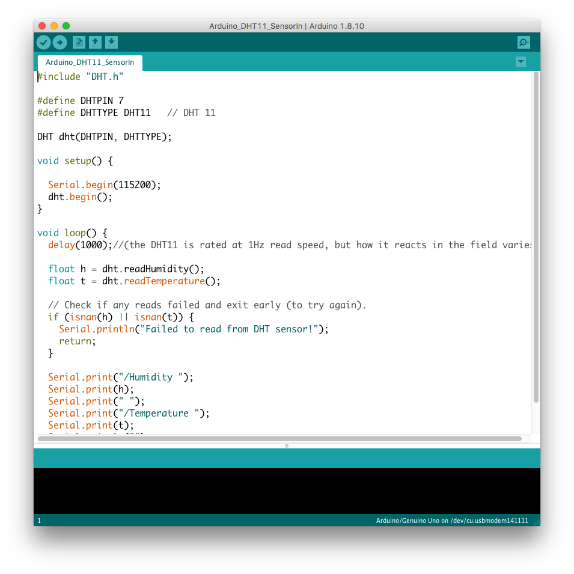
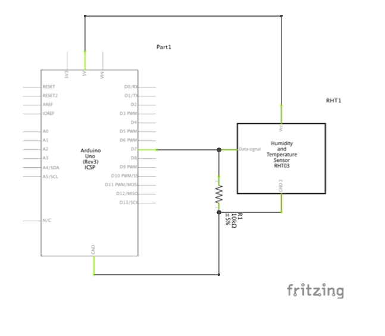
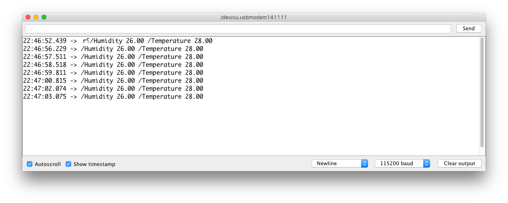
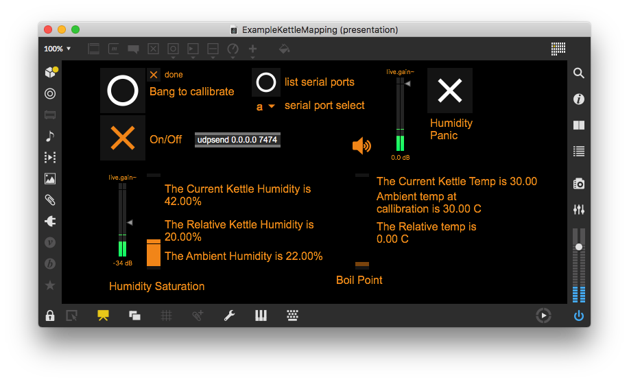
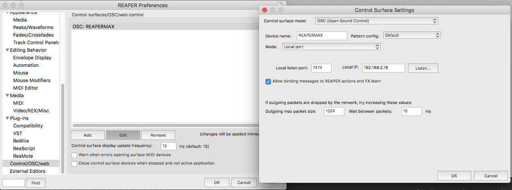

<!---layout: page
title: "Tutorial"
permalink: /tutorial/--->

<h2> You will need </h2>
* A DHT sensor
* <a href="https://www.arduino.cc/"> An Arduino & Associated Software </a>
* <a href="https://github.com/adafruit/DHT-sensor-library"> The DHT sensor library from Adafruit </a>
* At least one sound input on your computer, preferably a hydrophone placed inside of the kettle, but any audio signal could work
* <a href="cycling74.com"> A copy of MaxMSP </a>
* <a href="reaper.fm"> A copy of Reaper </a>

<h2> For the Reaper Session </h2>
* <a href="https://puremagnetik.com/collections/free-plugins/products/driftmaker-delay-disintegration-device"> Driftmaker from Puremagnetik (free) </a>
* <a href="https://www.soundhack.com/freeware/"> ++pitchdelay & ++bubbler from Soundhack (free) </a>
* <a href="https://www.soundhack.com/spectral-shapers/"> ++binaural (20$ USD, academic discount available on request)</a>
* <a href="http://www.michaelnorris.info/software/soundmagic-spectral"> Super Filterbank from Micheal Norris' Soundmagic Spectral (free) </a>

<h2> How To </h2>

1. Configure your DHT sensor as instructed by retailer/manufacturer. 4 pin DHT sensors will require you set up a resistor, either between the data pin & ground or 5V power. 3 pin models do not. Mount the sensor into your kettle of choice.
 

 
2. Upload the appropriate Arduino code to your Arduino unit, assuming the DHT library is already installed.
 
  

 
3. Hook up the DHT sensor to the Arduino. By default the example code provided uses Pin 7 for data input. Double check you are receiving the proper data in the Arduino Console.
 

 
4. Close the Arduino console, then boot the included Max patch. It should map to the Arduino automatically, but may require you set the serial port by hand using the dropdown menu in the max patch.
 

 
5. If using with the example Reaper session, boot Reaper now, and ensure it has an OSC receive port enabled at port 7474.

6. Hit calibrate. When the "done" trigger is orange you're ready to go! If you don't have a hydrophone, my example mappings will process your default mic input 1, which may feedback on itself if you are using your laptop's built in microphone.

 <a href="https://kaseypocius.github.io/MUMT306-MagicMappedKettle/about"> Back to the About</a>
